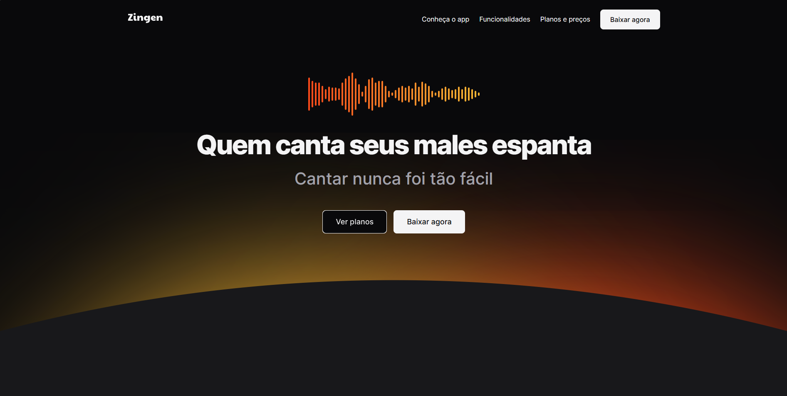

## 
Página com layout de um perfil de viagens

<b>TÓPICOS</b>

<a href="#-tecnologias">TECNOLOGIAS</a> | 
<a href="#️-ferramentas">FERRAMENTAS</a> |
<a href="#️-estrutura">ESTRUTURA</a> |
<a href="#-apresentação">APRESENTAÇÃO</a> | 
<a href="#-changelog">ATUALIZAÇÕES</a>

---

Projeto desenvolvido para explorar habilidades de responsividade em outros dispositivos e boas práticas de clean code absorvidas durante o curso <b>Fullstack - Rocketseat</b>

<a href="https://ayrtonyamashita.github.io/lp-zingen/">Clique aqui</a> para visitar o site em tempo real.

## 🤖 TECNOLOGIAS

Neste momento do projeto foram utilizadas apenas as tecnologias de HTML e CSS puros sem uso de frameworks ou ferramentas auxiliares para execução.

## ⚒️ FERRAMENTAS

Para o inicio do escopo, apresentando a ideia inicial foi utilizando o <a href="https://www.figma.com/"> <b>Figma</b> </a> para realizar o desenho e layout do projeto, tirando do papel e adaptando ao digital.  
Com essa ferramenta foi possível projetar a paleta de cores, fontes, tamanhos dentre outras opções presentes no projeto.
 
Iniciando na parte dos códigos, foi utilizado o <b><a href="https://vscode.dev/">VScode</a></b> devido a sua variedade de opções e aplicativos que auxiliam na proatividade do projeto.

## 🏗️ ESTRUTURA

O site possui uma organização estrutural em hierarquia de pastas para assets/icons/images assim como um index.css e outros demais que são adicionados de acordo com a necessidad do projeto.  

## 📺 APRESENTAÇÃO

 
O site apresenta uma landing page de um produto no ramo da música, o site é separado por seções que apresentam com detalhes ao cliente quais beneficios do produto, sobre as funcionalidades e uma aba de conhecimento geral para apresentação do mesmo.

<a href="https://ayrtonyamashita.github.io/lp-zingen/">Clique aqui</a> para visitar o site em tempo real.

## 🔃 CHANGELOG

19/07/2024 - Site publicado  
19/07/2024 - Adicionado o README.md  
